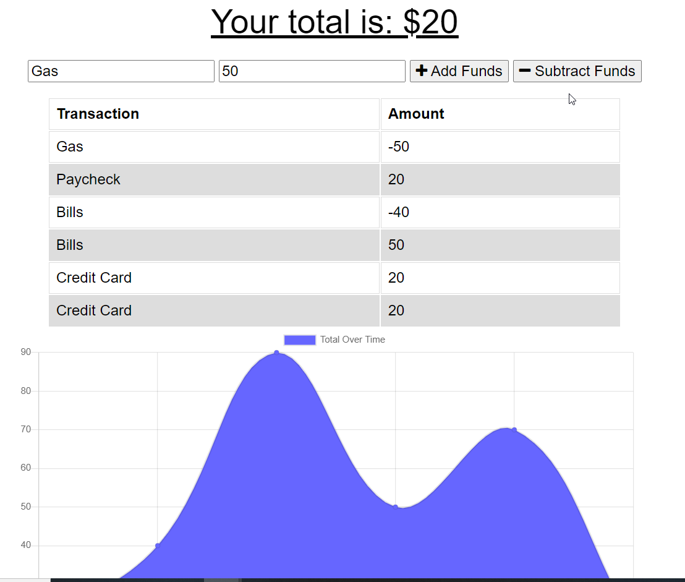

# Fitness-Tracker

This project was designed as a homework assignment for MSU's coding bootcamp. 

This application was created with the use of Javascript, Node.js, mongoDb, mongoose, express, html, and css. It has an MVC style directory as well as using MongoDb Atlas as the back end database and Heroku as the deployment server.

This projects' code can be found on my github (Link can be found below).

# Table of Contents
1. [Links](#Links)
2. [Project Overview](#projectoverview)
3. [Execution](#Execution)
4. [Contains](#Contains)
5. [Demonstration](#Demonstration)
6. [Future](#Future)

## Links

* [GitHub Repository](https://github.com/CMarcano7/Fitness-Tracker)
* [Heroku](https://sheltered-castle-64672.herokuapp.com/)

## Project Overview 

* This project was made so that the user could track the workouts they have completed over a certain period of time.

## Execution
### Use the Github Link above:
> First go to the Heroku link above.
> Next you can either create a new workout or continue a workout.

> After you can go through theinput fields and insert your workout.
  >First choose the type of workout, Resistance or Cardio, then continue on with the inputs.

>You can also head over to the dashboard(button at the top of the screen) and view your workouts there

## Contains: 
* models dir
    * fitness.js

* public dir
  * assets dir
    * preview images
  * api.js
  * exercise.html
  * exercise.js
  * index.html
  * index.js
  * stats.html
  * stats.js
  * style.css
  * workout.js

* routes dir
  * bapi.js
  * html.js

* seeders dir
  * seed.js

* server.js

* Express
    * [Express](https://expressjs.com/en/5x/api.html)

* MongoDb Atlas
    * [Atlas](https://docs.atlas.mongodb.com/)

* MongoDb
    * [MongoDb](https://docs.mongodb.com/)

* Mongoose
    * [Mongoose](https://www.npmjs.com/package/mongoose)

* Find node.js docs [Here](https://nodejs.org/dist/latest-v14.x/docs/api/)

## Demonstration

* Link to demo [Here](https://drive.google.com/file/d/1vb_BwU6Mk3jvdreGSO_qYvoByRqKrT30/view).
* MSU BootCamp

## Future

* For the future of this project I would like to create a feature so that the user can rate the burgers and place where they got them from so that other users are able to see.