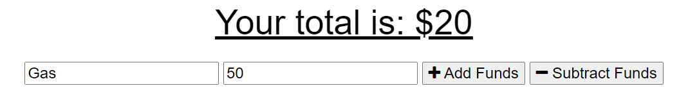
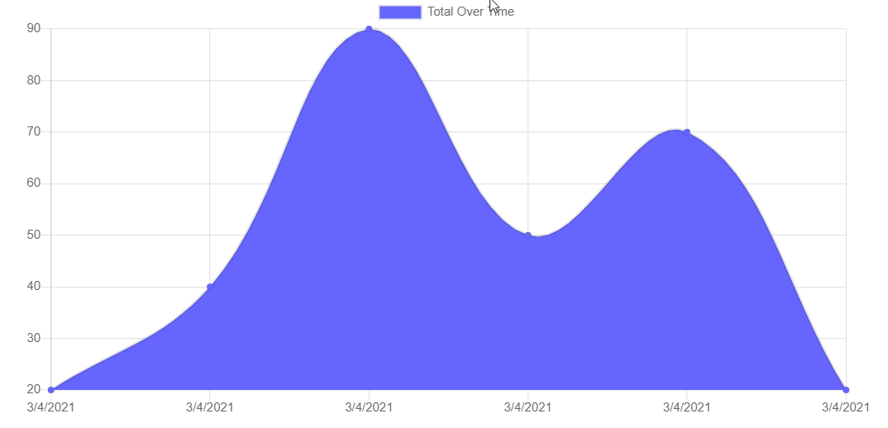
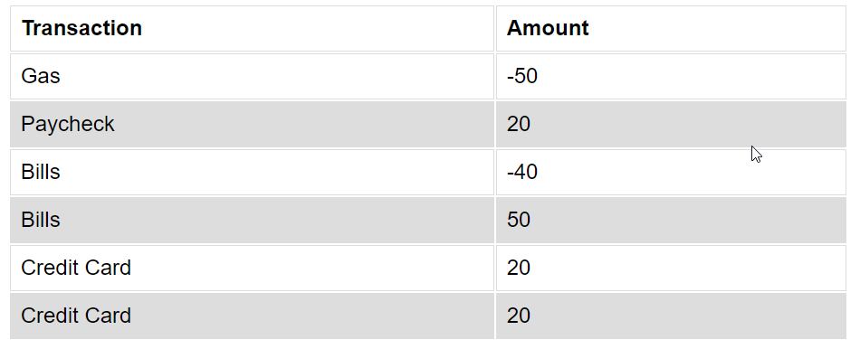

# Progressive-Budget

This project was designed as a homework assignment for MSU's coding bootcamp. 

This application was created with the use of Javascript, Node.js, mongoDb, mongoose, express, compression.js, lite-server.js, morgan.js, html, and css. It has an MVC style directory as well as using MongoDb Atlas as the back end database and Heroku as the deployment server, with PWA for offline capabilities.

This projects' code can be found on my github (Link can be found below).

# Table of Contents
1. [Links](#Links)
2. [Project Overview](#projectoverview)
3. [Execution](#Execution)
4. [Contains](#Contains)
5. [Demonstration](#Demonstration)
6. [Future](#Future)

## Links

* [GitHub Repository](https://github.com/CMarcano7/Progressive-Budget)
* [Heroku](https://rocky-dawn-08208.herokuapp.com/)

## Project Overview 

* This project was made so that the user can track their budget while online and offline.

## Execution
### Use the Github Link above:
> First go to the Heroku link above.
> Next you can either add  or subtract funds and give this function a name.

> The user can also see a graph representation of their funds

>Also a matrix of their fuunds and what they've named these transactions

## Contains: 
* models dir
    * transaction.js

* public dir
  * assets dir
    * preview images
  * icons dir
    * offline icons
  * index.html
  * manifest.webmanifest
  * pwa.js
  * service-worker.js
  * style.css

* routes dir
  * api.js

* package.json

* server.js

* Express
    * [Express](https://expressjs.com/en/5x/api.html)

* MongoDb Atlas
    * [Atlas](https://docs.atlas.mongodb.com/)

* MongoDb
    * [MongoDb](https://docs.mongodb.com/)

* Mongoose
    * [Mongoose](https://www.npmjs.com/package/mongoose)

* Compression
    * [Compression](https://www.npmjs.com/package/compression)

* Lite-Server
  * [Lite-Server](https://www.npmjs.com/package/lite-server)

* Morgan
  * [Morgan](https://www.npmjs.com/package/morgan)

* Find node.js docs [Here](https://nodejs.org/dist/latest-v14.x/docs/api/)

## Demonstration

* Link to demo [Here](https://drive.google.com/file/d/1IYpdSqknlLHOXgMwySxCMqAs5aKpc-r5/view).
* MSU BootCamp

## Future

* For the future of this project I would like to create a feature so that multiple users login and have access to their own budgets.